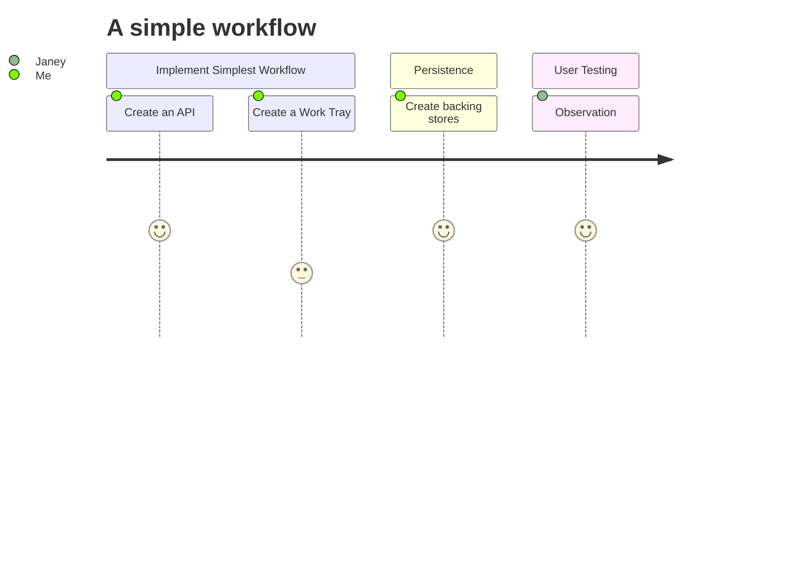

# mermaid-workflow
A project which aims to allow runnable user centric workflow described by mermaid diagrams

# Context
[Mermaid diagrams](https://mermaid.js.org/) is tool to create complex diagrams in simple markdown. Its main purpose is to help documentation catch-up with development.

# Problem statement
I would like to describe how work flows in a simple diagram.

This could be for:
My own simple to do list of work.
A repeatable pattern / process of work for use in an organisation.
Or to describe how services to end users work and how work flows between consumers of the service and the organisations which are required to fulfil the service e.g. [Service design](https://gds.blog.gov.uk/2016/04/18/what-we-mean-by-service-design/) 

# Constraints and Criteria
I would like to be able to describe my workflow as simply as possible in a mermaid diagram.
I want the diagram to be "test-able / run-able" with as little (ideally no) effort as possible.

# Solution concepts

