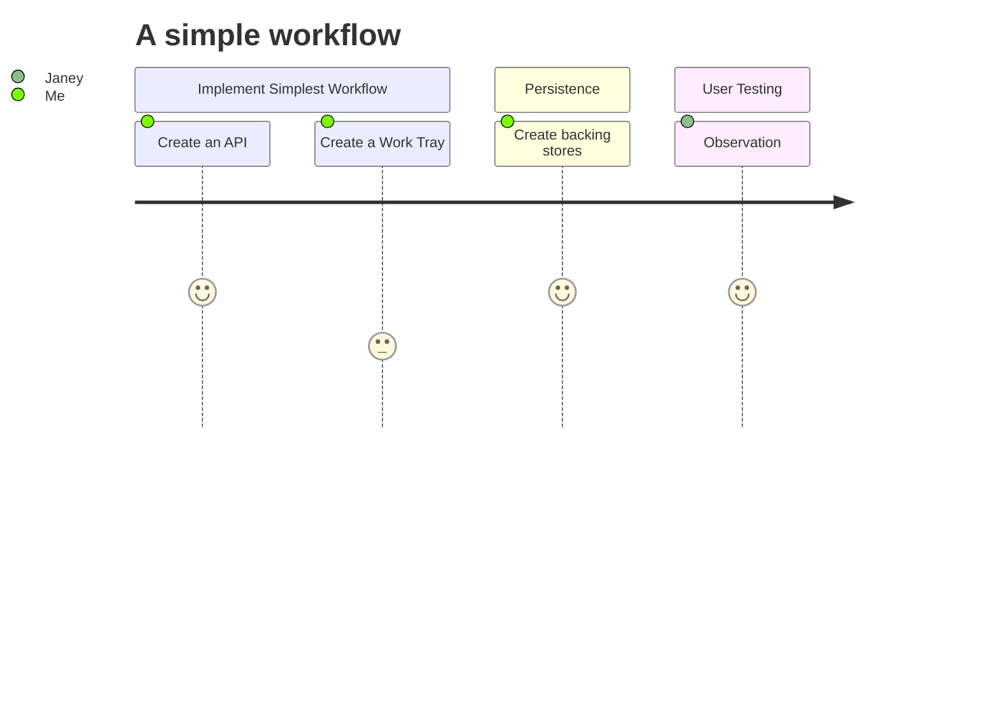
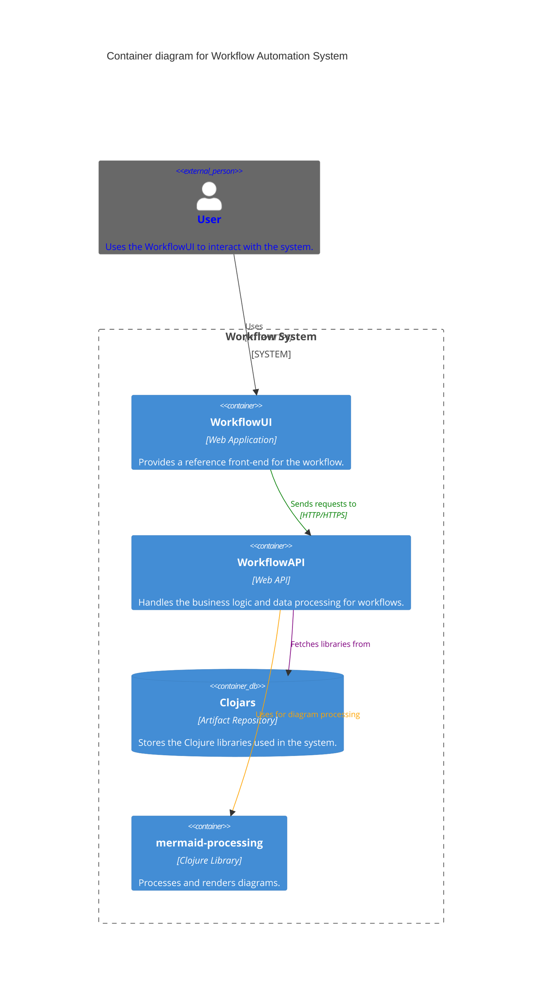
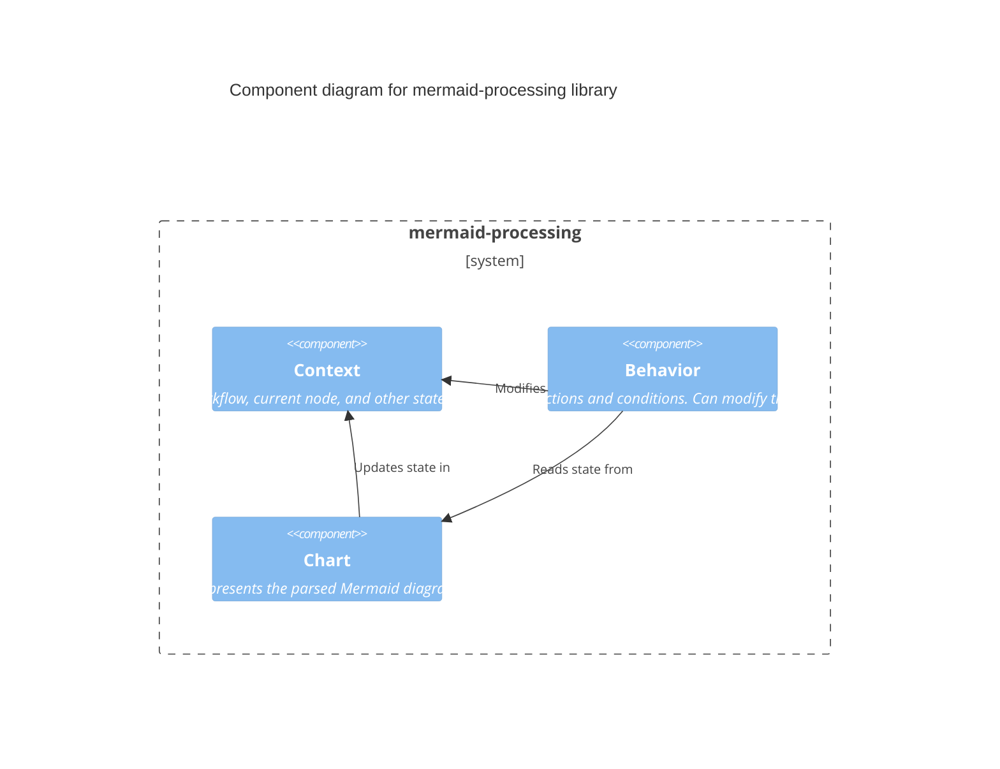

[](https://github.com/jonnymoo/mermaid-workflow/actions/workflows/test-and-deploy.yml)

# mermaid-workflow
Runnable user centric workflow described by mermaid diagrams

# Context
[Mermaid diagrams](https://mermaid.js.org/) is tool to create complex diagrams in simple markdown. Its main purpose is to help documentation catch-up with development.

# Problem statement
I would like to describe how work flows in a simple diagram.

This could be for:
- My own simple to do list of work.
- A repeatable pattern / process of work for use in an organisation.
- To describe how services to end users work and how work flows between consumers of the service and the organisations which are required to fulfil the service e.g. [Service design](https://gds.blog.gov.uk/2016/04/18/what-we-mean-by-service-design/) 

# Constraints and Criteria
I would like to be able to describe my workflow as simply as possible in a mermaid diagram.
I want the diagram to be "test-able / run-able" with as little (ideally no) effort as possible.

# Live Demo - Swagger UI

[Here is a Swagger UI implentation of the OpenAPI rest interface project in mermaid-worflow-api](https://mermaid-workflow-api.azurewebsites.net/)

To use it you can provide a context, chart, and mappings input.

Chart is a mermaid chart (or a URL to a mermaid chart) and mapping is the action-mapping file (or a URL to it) which shows how to map nodes and routes to actions.

An example chart is here https://raw.githubusercontent.com/jonnymoo/mermaid-workflow/main/mermaid-processor/test/resources/lhasa/flowchart.mermaid

An example mapping is here https://raw.githubusercontent.com/jonnymoo/mermaid-workflow/main/mermaid-processor/test/resources/lhasa/mappings.json 

These demonstrate the Lhasa example (see below for more details)

To try it out you need to set the field svg-input to be a string containing an svg test file. The workflow will then convert this to SVG and nagivate down the flow chart. Tip - you need to json stringify the input, you can use an online utility to do this e.g. https://jsonformatter.org/json-stringify-online

Here is an example input.

```
{
  "context":  {"fields": {"svg-input":"<svg xmlns=\"http://www.w3.org/2000/svg\" width=\"600\" height=\"600\">\r\n  <circle cx=\"150\" cy=\"150\" r=\"65\" fill=\"blue\" />\r\n  <circle cx=\"350\" cy=\"250\" r=\"70\" fill=\"blue\" />\r\n  <circle cx=\"250\" cy=\"450\" r=\"25\" fill=\"blue\" />\r\n</svg>"}},
  "chart": "https://raw.githubusercontent.com/jonnymoo/mermaid-workflow/main/mermaid-processor/test/resources/lhasa/flowchart.mermaid",
  "mappings": "https://raw.githubusercontent.com/jonnymoo/mermaid-workflow/main/mermaid-processor/test/resources/lhasa/mappings.json"
}
```

Expand /chart/process and choose "Try it out".

Paste the input into the request body, choose "Execute" and examine the response body. You will see a number of fields, the one of interest is the score. Also of note is the path taken, and the audit which will show you how the input was processed through the chart.

Enjoy.

If you want to try other tests, have a look at the Lhasa examples below and pick other SVG inputs to try from the [test input resources](https://github.com/jonnymoo/mermaid-workflow/tree/main/mermaid-processor/test/resources/lhasa/inputs). The number at the end of the file name denotes what the expected score is (apart from random_svg_661-II.svg which gives a score of one back - I think this is just a mistake)


# Quick Start Guide for mermaid-processing

## Prerequisites

### 1. Java
Ensure you have Java installed. You can check by running:
```
java -version
```
If not installed, download and install the OpenJDK from [AdoptOpenJDK's official website](https://adoptopenjdk.net/).

### 2. Clojure
Install Clojure using the instructions provided on the [official Clojure site](https://clojure.org/guides/getting_started).

### 3. Leiningen
This is a build tool for Clojure. Install it by following the instructions on the [official Leiningen website](https://leiningen.org/).

## Setting Up the Project

### 1. Clone the Repository
```
git clone https://github.com/jonnymoo/mermaid-workflow.git
cd mermaid-workflow
cd mermaid-processor
```

### 2. Fetch Dependencies
```
lein deps
```

### 3. Run the Tests
```
lein test
```
This will execute all the tests in the project. Ensure all tests pass to verify that everything is set up correctly.

## Exploring Further: Understanding the Lhasa Test

The Lhasa test, located in `/mermaid_processor/test/mermaid_processor/lhasa_test.clj`, is a test suite designed by Lhasa here https://github.com/jmaes12345/lhasa-kata

It has been used to show how to provide custom functionality and run an automatic from a mermaid flowchart.

### The Mermaid Flowchart

The test begins by reading a Mermaid flowchart from the file `resources/lhasa/flowchart.mermaid`. This flowchart describes the expected behavior and conditions that SVG files should meet.

```
(def mermaid 
  (slurp 
   (io/resource "resources/lhasa/flowchart.mermaid")))

(def lhasa-chart 
  (parse/parse-mermaid mermaid))
```

[View the flowchart.mermaid file](https://github.com/jonnymoo/mermaid-workflow/blob/main/mermaid-processor/test/resources/lhasa/flowchart.mermaid)

### Action Map

The `action-map` is a collection of regex patterns paired with corresponding actions. Each regex pattern is designed to match specific conditions or queries from the Mermaid flowchart. When a match is found, the associated action is executed.

### Single File Test

The `process-lhasa-example-test` function is an example of how to process a single SVG file against the Mermaid flowchart. It uses the behaviors derived from the action map and the parsed Mermaid chart to make decisions according to contents of the SVG file and generate a score.

### Processing All SVG Files

The `process-lhasa-all-examples-test` function is designed to process all SVG files located in the `resources/lhasa/inputs/` directory. For each SVG file, the test determines the expected score based on the file's naming convention (e.g., `-I.svg` indicates a score of 1). It then processes the SVG file using the behaviors and the Mermaid chart and compares the expected score with the actual score.

### API Documentation 

[API Documentation](https://jonnymuir.com/mermaid-workflow/mermaid-processor/docs/index.html)

Note - to build the documentation

```
cd mermaid-processor
lein codox
```

### Conclusion

For a deeper dive, explore the [Lhasa test file](https://github.com/jonnymoo/mermaid-workflow/blob/main/mermaid-processor/test/mermaid_processor/lhasa_test.clj) in the repository

# Solution concepts

### Bugs and Issues

...

## Design guidelines

Use TDD to implement a modular / composable design that promotes simplicity over complexity

Order function parameters by specificity (general to specific), e.g. my-function [context behavior item]

Aim towards a DDD like Ubiquitous Language. This means entities should use real life terms from the business / user domain. This language should be refleced in the code. And on language, a decision has been made to not use british english, but stick with american english, e.g. behavior, not behaviour. This is simply to make it consistent with other code bases.

Dont throw an exception unless it really is an exception. As a rule dont handle exceptions in business logic code. Let the top layer handle it and report it appropriately. The exception to this rule is if you want to decorate the exception with more information and then rethrow it.

Keep any messy code as small as possible and as close to the entry point to the application (the composition root). Messy code is code with is non-deterministric, input driven, needs to access external systems. Do all this first and pass it into your domain logic. This helps you organise you systems with the appropriate level and direction of interconnectivity and lower complexity.




# Azure setup

For development if you want to run a sqlite database you will need to 