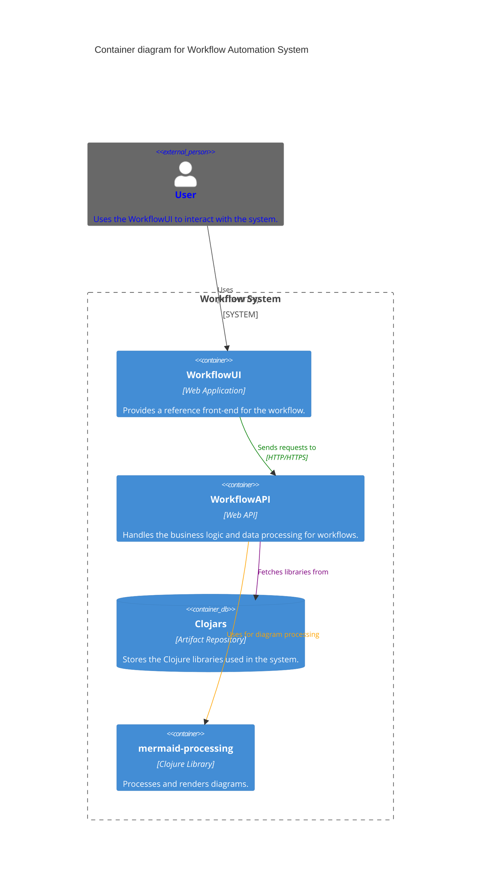
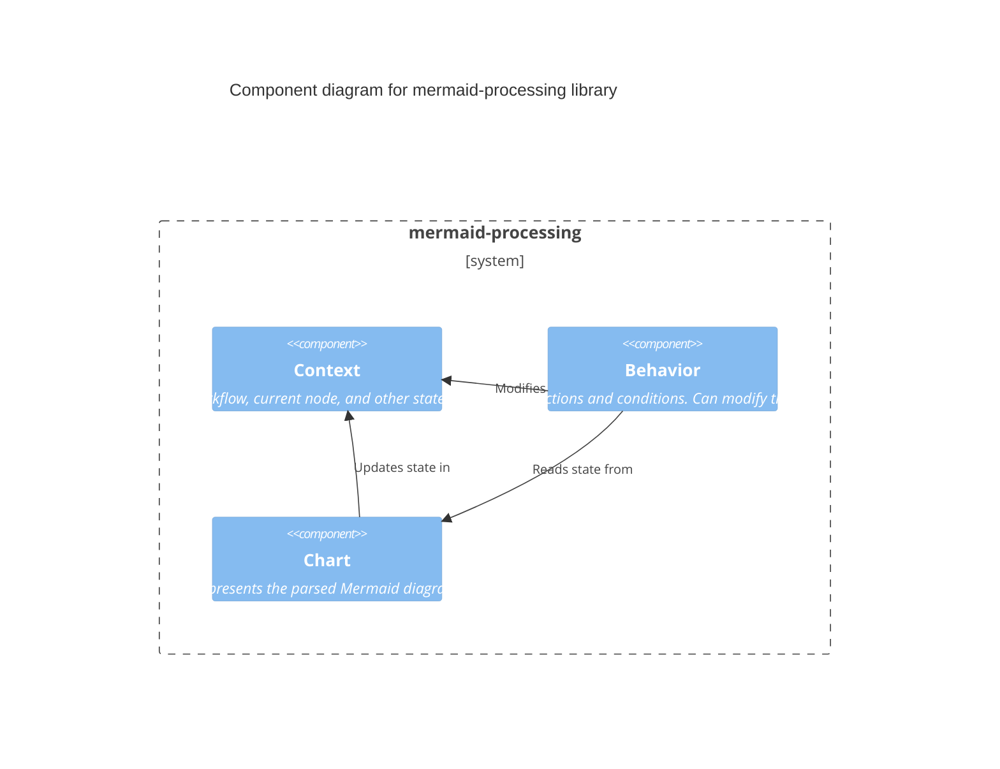

# mermaid-processor

The main logic for processing mermaid diagrams.

## Installation

Download from http://example.com/FIXME.

## Usage

FIXME: explanation

    $ java -jar mermaid-processor-0.1.0-standalone.jar [args]

## Options

FIXME: listing of options this app accepts.

## Examples

...

### Bugs and Issues

...

## Design guidelines

Use TDD to promote a modular design that promotes simplicity over complexity

Order function parameters by specificity (general to specific), e.g. my-function [context behavior item]

Aim towards a DDD like Ubiquitous Language. This means entities should use real life terms from the business / user domain. This language should be refleced in the code. And on language, a decision has been made to not use british english, but stick with american english, e.g. Behavoir, not behavoir. This is simply to make it consitent with other code bases.

